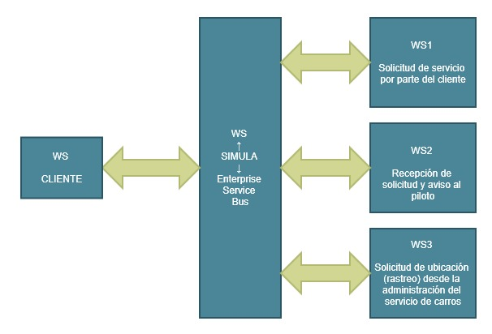

[SA] Aplicacion SOA con Microservicios y ESB
===

Para desarrollar esta tarea utilizamos lo siguiente:
  1. Windows10 como Sistema Operativo.
  2. Python V3.7.4 como lenguaje de programacion.
  3. Flask como microframework para crear servicios.
---

### Configuracion Basica:

  1.  Crear un proyecto que contendra nuestra solucion.
  2.  Crear el/los archivos que compondra nuestra solucion.
  3.  Abrir una terminal dentro de nuestro proyecto.
  4.  Crear un Entorno Virtual, con el siguiente comando dentro de nuestra consola
  ```
     C:\Users\Name\Desktop\NameProject>py -3 -m venv venv
  ```
  5.  Activar el Entorno Virtual creado, con el siguiente comando dentro de nuestra consola
  ```
    C:\Users\Name\Desktop\NameProject>venv\Scripts\activate
  ```
  6.  Instalar la libreria de Flask para nuestros servicios, con el siguiente comando dentro de nuestra consola
  ```
    (venv) C:\Users\Name\Desktop\NameProject>pip install Flask
  ```
  7.  Identificar el archivo que contendra el servicio, con el siguiente comando dentro de nuestra consola
  ```
    (venv) C:\Users\Name\Desktop\NameProject>set FLASK_APP=<NombreArchivo>.py
  ```
  8.  Ejecutar el servicio, con el siguiente comando dentro de nuestra consola
  ```
    (venv) C:\Users\Name\Desktop\NameProject>python -m flask run
     * Serving Flask app "Prueba.py"
     * Environment: production
       WARNING: This is a development server. Do not use it in a production deployment.
       Use a production WSGI server instead.
     * Debug mode: off
     * Running on http://127.0.0.1:5000/ (Press CTRL+C to quit)
  ```
  9.  Parar el servicio, con el siguiente comando dentro de nuestra consola
  ```
    Press CTRL+C to quit
  ```
  10.  Salir del Entorno Virtual, con el siguiente comando dentro de nuestra consola
  ```
    (venv) C:\Users\Name\Desktop\NameProject>deactivate
    
    C:\Users\Name\Desktop\NameProject>
  ```
---
### Enunciado:
Realizar una aplicación SOA para simular los siguientes servicios de carros tipo Uber:

1. Solicitud de servicio por parte del cliente    [Servicio1](../Service1_SolicitudServicioCliente/README.md)
2. Recepción de solicitud y aviso al piloto       [Servicio2](../Service2_SolicitudServicioPiloto/README.md)
3. Solicitud de ubicación (rastreo) desde la administración del servicio de carros    [Servicio3](../Service3_SolicitudRastreo/README.md)

Debe ser realizado con servicios orquestados por medio de un ESB

---

### Desarrollo del problema:

Se identifican segun requerimientos que existen 3 servicios que deben interactuar entre si, pero como mediador debe de existir un Enterprise Service Bus (ESB) quien se encargara de orquestar el funcionamiento de los servicios.


---

### Solucion:

Como se nos pide que realicemos nuestro propio ESB se crea un WebService que cumplira la funcion de orquestar todo el trafico que reciba de parte de los servicios.
En la siguiente imagen podemos observar la solucion propuesta para la arquitectura de este enunciado:


---

### ANEXOS:

1.  https://werkzeug.palletsprojects.com/en/0.14.x/serving/
2.  https://www.python.org/downloads/
3.  https://flask.palletsprojects.com/en/1.1.x/
4.  https://palletsprojects.com/p/flask/
5.  https://palletsprojects.com/p/jinja/


