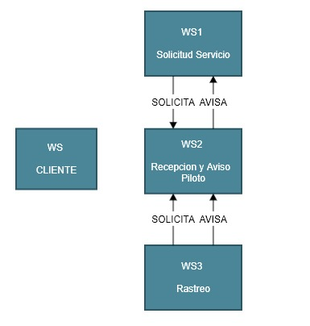

[SA] Aplicacion SOA con Microservicios y ESB
===
## BPEL

Por inconveniente con la herramienta se procedio a cambiar los servicios de REST a SOAP para luego que estos servicios se comunicaran con el orquestador BPEL con los demas servicios.

Para desarrollar esta tarea utilizamos lo siguiente:
  1. Windows10 como Sistema Operativo.
  3. Java Enviroment (JDK y JRE).
  2. Eclipse Oxygen.
  3. ASP.net para crear servicios SOAP.
---

### Configuracion Basica:

  1.  Crear un proyecto en .NET que contendra nuestra solucion con los servicios.
  2.  Crear un proyecto por cada servicio que se va a consumir en Eclipse oxygen.
  4.  Modificar el proceso BPEL para definir las reglas de negocio.
  5.  Al terminar de realizar los servicios se deben descargar el WSDL que este nos crea para luego adjuntarlo al proyecto de BPEL
  6.  La solucion completa se encuentra en la siguiente [Carpeta](BPEL_TAREA4)
  
  ```
     
  ```

---
### Enunciado:
Realizar una aplicación SOA para simular los siguientes servicios de carros tipo Uber:

1. Solicitud de servicio por parte del cliente    [Servicio1](Service1_SolicitudServicioCliente/README.md)
2. Recepción de solicitud y aviso al piloto       [Servicio2](Service2_SolicitudServicioPiloto/README.md)
3. Solicitud de ubicación (rastreo) desde la administración del servicio de carros    [Servicio3](Service3_SolicitudRastreo/README.md)

Debe ser realizado con servicios orquestados por medio de un ESB

---

### Desarrollo del problema:

Se identifican segun requerimientos que existen 3 servicios que deben interactuar entre si, pero como mediador debe de existir un Orquestador (BPEL) quien se encargara de orquestar el funcionamiento de los servicios.


---

### Solucion:

Como se nos pide que realicemos nuestro propio ESB se crea un WebService que cumplira la funcion de orquestar todo el trafico que reciba de parte de los servicios.
En la siguiente imagen podemos observar la solucion propuesta para la arquitectura de este enunciado:


---

### ANEXOS:

1.  https://www.eclipse.org/downloads/
2.  https://www.eclipse.org/bpel/
3.  https://www.eclipse.org/bpel/users/howto/ode.php
4.  http://tomcat.apache.org/
5.  https://ode.apache.org/

# VIDEO:
[SA_Video_Tarea2_3](https://www.youtube.com/watch?v=nJOGVfv9cVY)
