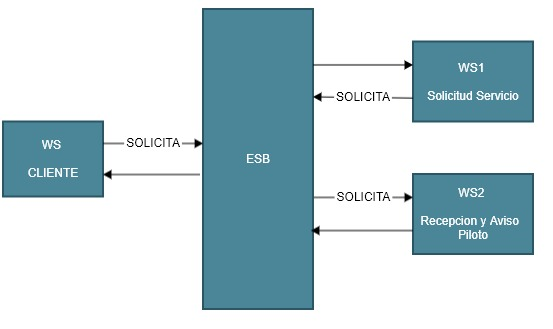

# Solicitud de servicio por parte del cliente

### SERVICIO 1

### Desarrollo del problema:
Para este primer servicio el CLI interactua con el ESB que realiza una peticion hacia el servicio de solicitud que luego vuelve a interactuar con el ESB para que se le notifique al servicio que representa al piloto.

---

