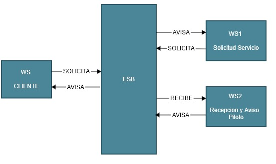

# Recepcion de solicitud y aviso al piloto

### SERVICIO 2

### Desarrollo del problema:
Para este segundo servicio el CLI ya ha interactuado con el ESB quien realizo una peticion hacia el servicio de solicitud que luego vuelve a interactuar con el ESB para que se le notifique al servicio que representa al piloto y este ultimo pueda responder lo antes posible al cliente.

---

