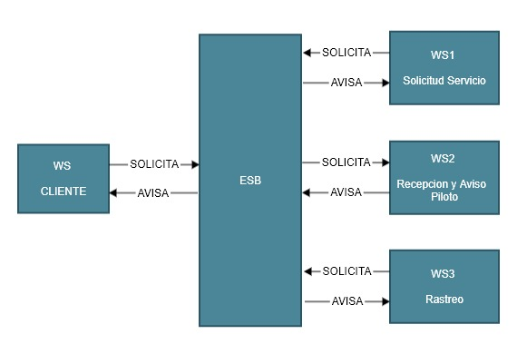

# Solicitud de ubicacion (rastreo) desde la administración del servicio de carros

### SERVICIO 3

### Desarrollo del problema:
Este tercer servicio se encargara de notificar a la administracion la ubicacion del piloto para que luego por medio del ESB se pueda responder lo antes poisble al solicitante.

---

